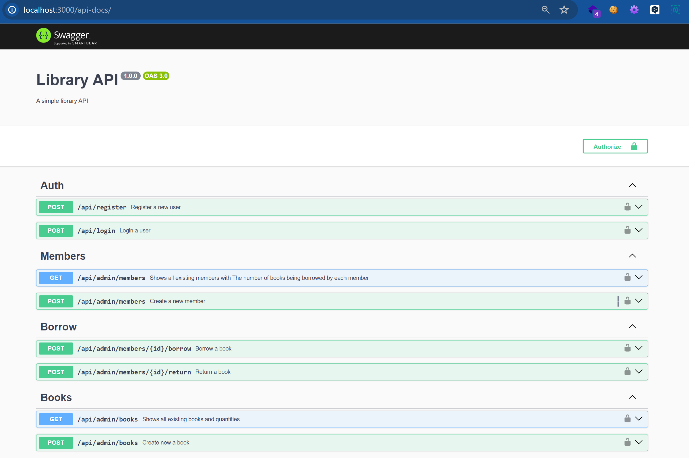

# Backend-library-RestfulAPI
Restful API peminjaman buku menggunakan Javascript 
    
    stack : 
        - nodejs
        - express
        - prisma orm
        - mysql

### Features

Members can borrow books with conditions
   
   1. Members may not borrow more than 2 books
   2. Borrowed books are not borrowed by other members
   3. Member is currently not being penalized

Member returns the book with conditions
    
 1. The returned book is a book that the member has borrowed
 2. If the book is returned after more than 7 days, the member will be subject to a penalty. Member with penalty cannot able to borrow the book for 3 days

Check the book
 
 1. Shows all existing books and quantities
 2. Books that are being borrowed are not counted

Member check
 
 1. Shows all existing members
 2. The number of books being borrowed by each member

### How to running app

1. pastikan nodejs dan database mysql / mariadb sudah terinstall
2. pastikan sudah clone repo project ini
3. buka terminal dan arahkan ke dalam directory project
4. rename .env.example to .env
5. buat database baru dengan nama db_library, sesuaikan pada .env
6. lakukan migrate database dengan menjalankan perintah berikut pada terminal : 
    
        $ npx prisma generate
        $ npx prisma migrate dev --preview-feature

7. untuk running app jalankan perintah berikut 

        $ node index.js

        
8. atau install nodemon dimana fungsi nya tool bantuan automatic restart jika ada perubahan pada codingan.

cara install : 

     install secara global :  $ npm install -g nodemon
     install secara local project : npm install --save-dev nodemon

using nodemon 

        $ nodemon index.js

### Documentation API

    using swagger documentation api

    http://ip-address:3000/api-docs/

    

### deploy menggunakan docker 

        $ docker build -t backendborrow:v2 .
        $ docker compose build
        $ docker swarm init 
        $ docker stack deploy --compose-file docker-compose.yml backend-api